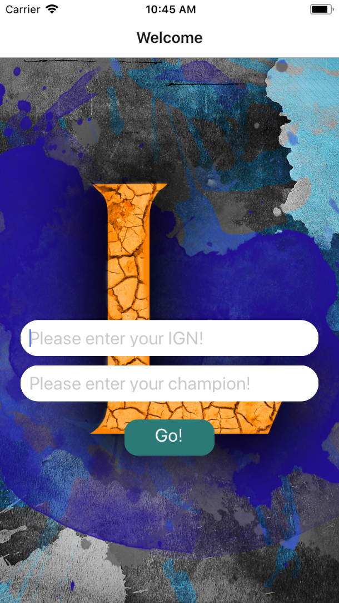
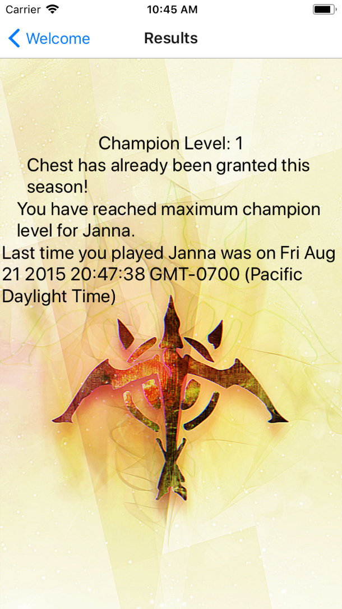
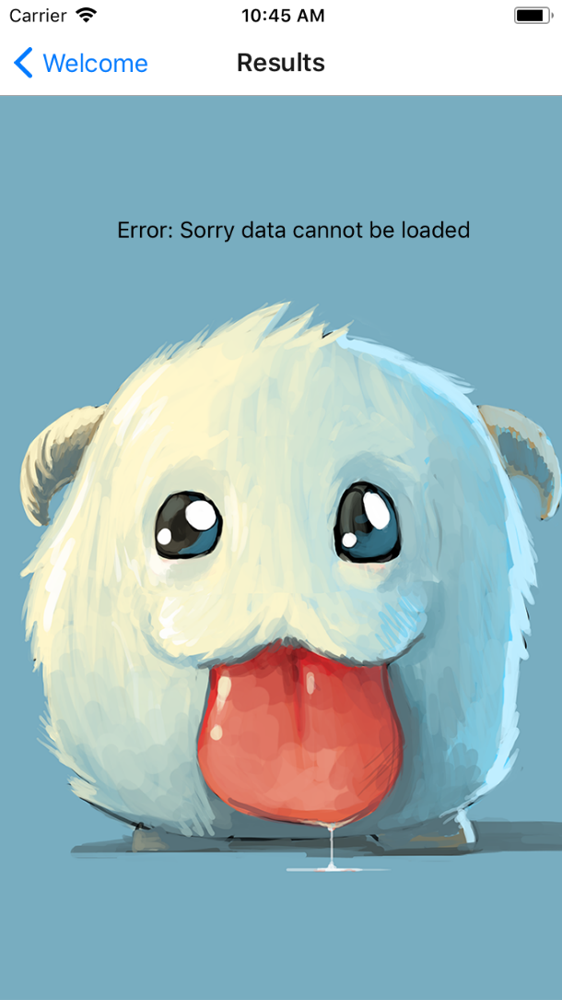

# LastTimePlayed

This project is a personal project written in React Native, and is based on the worlds’ most popular video game, League of Legends. The server-sided operations were implemented to query data for users by utilizing League of Legends’ RESTful API. The client-sided user experience interface was established with React Native’s framework/components to display data such as
champion level, awards gained, experience points until next level, and the last time playing a character.

### Welcome Screen

### Results Screen

### Error Screen

